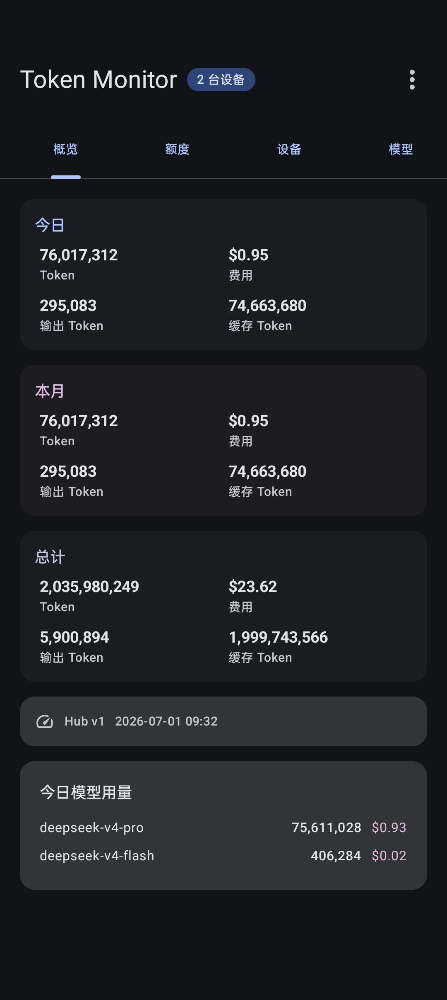
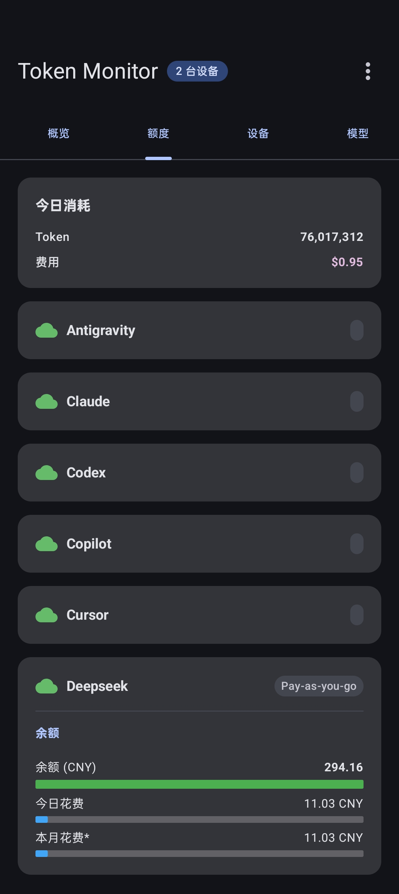
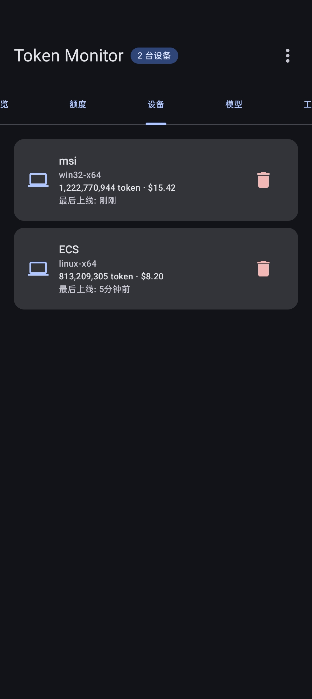
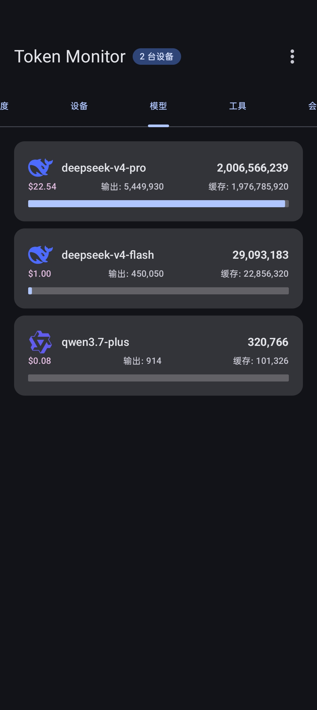
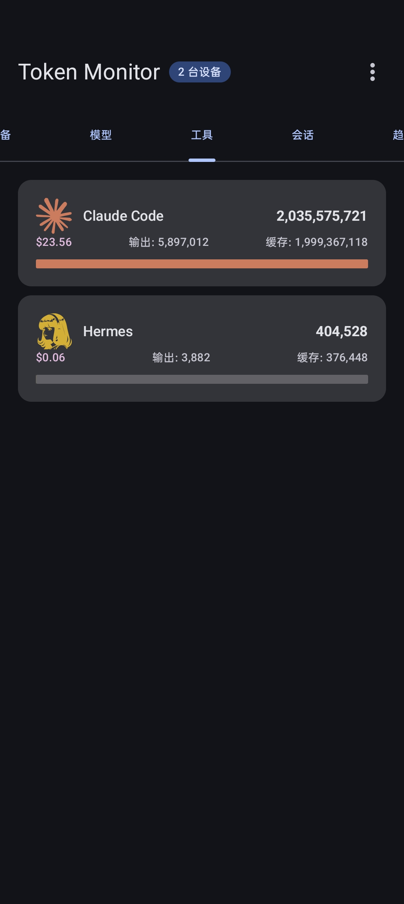
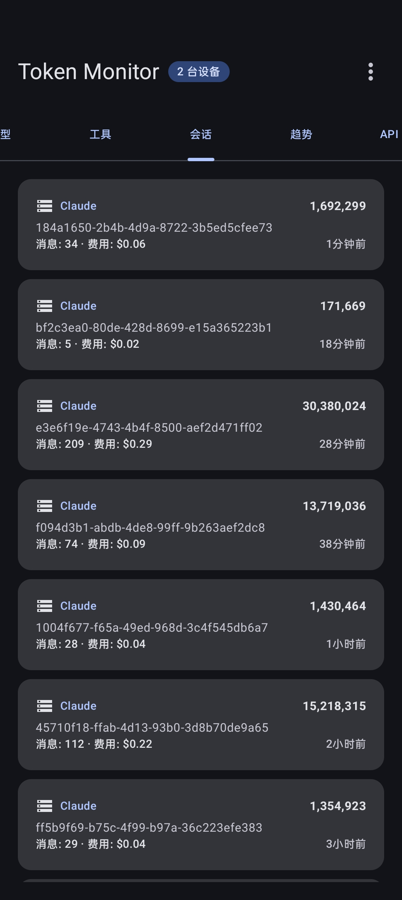
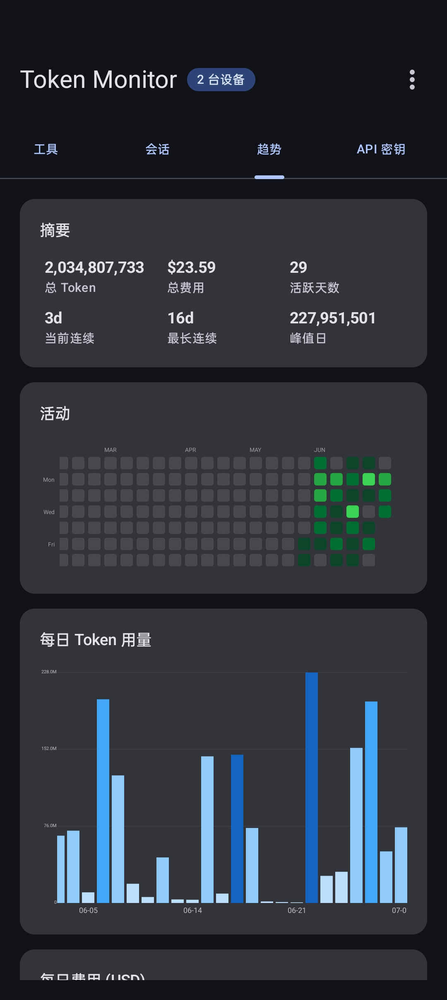
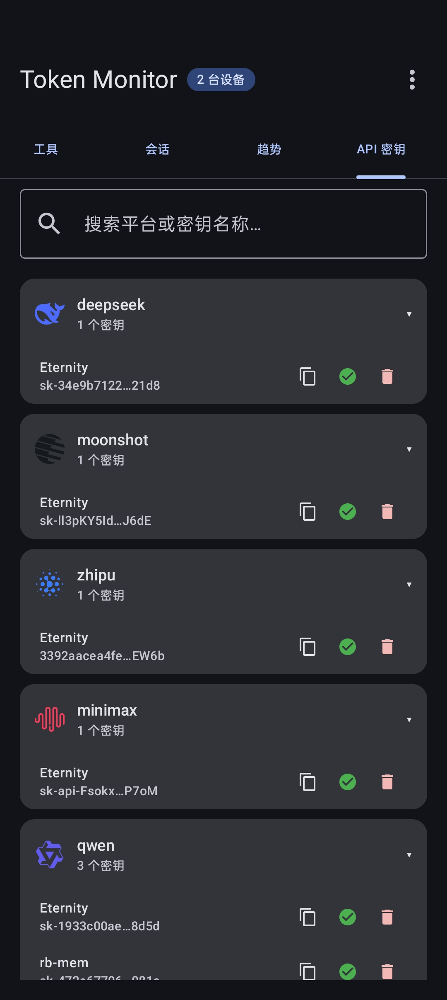
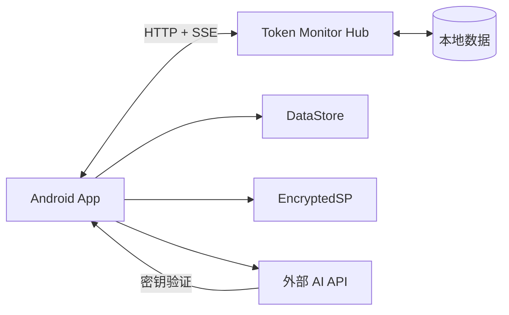

<p align="center">
  
</p>

<h1 align="center">Token Monitor</h1>

<p align="center">
  <strong>📱 AI Token 用量移动监控面板</strong>
</p>

<p align="center">
  <a href="LICENSE"></a>
  <a href="#"></a>
  <a href="#"></a>
  <a href="#"></a>
  <a href="#"></a>
</p>

---

## 📖 简介

Token Monitor 是一款 Android 原生应用，作为 [Token Monitor Hub](https://github.com/Javis603/token-monitor) 的移动客户端，让你随时随地在手机上追踪 AI 编程工具的 Token 消耗、费用支出和 API 配额使用情况。

它与桌面端的 Token Monitor 共享同一个 Hub 后端，通过 Server-Sent Events 实现实时数据同步，支持多设备协同监控。

<details>
<summary>📑 目录</summary>

- [功能特性](#-功能特性)
- [屏幕截图](#-屏幕截图)
- [技术架构](#-技术架构)
- [快速开始](#-快速开始)
- [使用指南](#-使用指南)
- [项目结构](#-项目结构)
- [致谢](#-致谢)
- [许可证](#-许可证)

</details>

## ✨ 功能特性

### 📊 概览
- 今日 / 本月 / 总计三张用量卡片，Token 数与费用一目了然
- Hub 版本信息与服务器时间显示
- 今日使用量 Top 10 模型排行

### 📈 配额
- 各 AI 提供商（OpenAI、DeepSeek、Anthropic 等）预付余额进度条
- 充值余额的今日 / 本月消费占比
- 速率限制窗口可视化，含已用比例、颜色阈值和重置倒计时

### 🖥️ 设备
- 所有已连接设备列表，含平台、总用量和最后活跃时间
- 点击查看设备详情，滑动删除离线的设备

### 🧠 模型
- 全时段模型用量排名，按 Token 消耗降序排列
- 每模型展示输出 Token、缓存 Token、费用及可视化占比图

### 🔧 工具
- 按 AI 客户端工具（Claude Code、Cursor、Cline、Copilot 等 30+）分组统计
- 每个工具配有专属 SVG 图标和品牌色

### 💬 会话
- 每次 AI 对话的完整记录：客户端、会话 ID、Token、消息数、费用
- 点击展开详情：输入 / 输出 / 缓存 / 推理 Token 明细，使用的模型和提供商

### 📅 趋势
- GitHub 风格 53 周活跃热力图
- 30 天日 Token 用量柱状图
- 30 天日费用趋势图
- 近 12 个月月度汇总

### 🔑 API 密钥
- AES-256-GCM 加密存储，支持 16+ AI 平台
- 一键验证密钥有效性
- JSON 批量导入 / 导出
- 支持自定义平台

### 🌐 更多
- 🇨🇳 / 🇺🇸 中英文双语，运行时即时切换
- 📡 SSE 实时流，Hub 数据变更秒级同步
- 🔗 支持 HTTP 明文连接（本地 Hub / 内网环境）

## 📸 屏幕截图

### 概览 · 配额 · 设备 · 模型

<p align="center">
  
  
  
  
</p>

### 工具 · 会话 · 趋势 · API 密钥

<p align="center">
  
  
  
  
</p>

## 🏗️ 技术架构



| 层级 | 技术选型 | 说明 |
|:-----|:---------|:-----|
| **语言** | Kotlin 2.2 | 全项目 Kotlin，无 Java |
| **UI** | Jetpack Compose + Material 3 | 声明式 UI，支持动态取色 |
| **导航** | HorizontalPager | Compose 原生分页，轻量无依赖 |
| **网络** | Ktor Client (OkHttp) | 协程式 HTTP 客户端，支持 SSE 流 |
| **序列化** | Kotlinx Serialization | 编译期类型安全，无反射 |
| **图片** | Coil + SVG Decoder | 异步加载，支持原始 SVG |
| **持久化** | DataStore Preferences | Hub 连接配置存储 |
| **加密** | EncryptedSharedPreferences | API 密钥 AES-256-GCM 加密 |
| **架构** | MVVM (ViewModel + StateFlow) | 单向数据流，生命周期安全 |
| **构建** | Gradle + Version Catalog | 集中式依赖版本管理 |

## 🚀 快速开始

### 前置条件

| 工具 | 最低版本 |
|:-----|:---------|
| Android Studio | 2024+ |
| JDK | 17+ |
| Android SDK | API 36 |
| Gradle | 9.2+ |
| 运行设备 | Android 12 (API 31)+ |

### 构建

```bash
# 克隆仓库
git clone https://github.com/myhMARS/TokenMonitor-Andorid.git
cd TokenMonitor-Andorid

# 编译调试版 APK
./gradlew assembleDebug

# 直接安装到连接的设备
./gradlew installDebug
```

编译产物位于 `app/build/outputs/apk/debug/app-debug.apk`。

### 准备 Hub 后端

使用本应用前，需要先运行一个 Token Monitor Hub 实例：

- **桌面端托管**：在 Token Monitor 桌面应用中进入 `Settings → Multi-device Sync → Host hub on this device`
- **独立部署**：`git clone https://github.com/Javis603/token-monitor && npm run hub`

记录下 Hub 的 URL 和 Shared Secret，后续在应用设置页填入即可。

## 📖 使用指南

1. **连接 Hub** — 首次启动进入设置页，输入 Hub 地址和共享密钥，点击连接
2. **浏览数据** — 验证通过后进入仪表盘，左右滑动切换 8 个功能标签页
3. **快捷操作** — 右上角菜单提供「刷新」「切换语言」「API 密钥管理」「断开连接」
4. **管理密钥** — 在「API 密钥」标签页中添加、验证、导入导出各平台密钥
5. **实时同步** — 应用自动通过 SSE 接收 Hub 推送的实时数据更新，无需手动刷新

## 📁 项目结构

```
TokenMonitor/
├── app/
│   ├── build.gradle.kts                    # 应用模块构建配置
│   └── src/main/
│       ├── AndroidManifest.xml
│       ├── res/
│       │   ├── raw/                         # 30+ AI 工具 SVG 图标
│       │   ├── values/strings.xml           # 英文字符串
│       │   ├── values-zh/strings.xml        # 中文字符串
│       │   └── xml/                         # 备份与数据提取规则
│       └── java/com/tokenmonitor/app/
│           ├── MainActivity.kt              # 单 Activity 入口
│           ├── data/
│           │   ├── ApiKeyStorage.kt         # 密钥加密存储
│           │   ├── HubPreferences.kt        # Hub 配置持久化
│           │   ├── LocaleManager.kt         # 语言切换管理
│           │   ├── TokenMonitorApi.kt       # Ktor HTTP API 层
│           │   ├── TokenMonitorRepository.kt # 数据仓库
│           │   └── model/
│           │       ├── ApiKeyModels.kt      # 密钥数据模型
│           │       └── HubModels.kt         # Hub 响应数据模型
│           └── ui/
│               ├── DashboardViewModel.kt    # 全局视图状态管理
│               ├── screen/
│               │   ├── SetupScreen.kt       # 连接设置页
│               │   ├── DashboardScreen.kt   # 仪表盘主界面 (8 标签)
│               │   └── ApiKeysTab.kt        # API 密钥管理
│               └── theme/
│                   ├── Color.kt
│                   ├── Theme.kt
│                   └── Type.kt
├── gradle/
│   └── libs.versions.toml                  # 版本目录
├── build.gradle.kts                         # 根构建配置
├── settings.gradle.kts
└── gradle.properties
```

## 🙏 致谢

本项目是 [Token Monitor](https://github.com/Javis603/token-monitor) 的 Android 客户端实现。

特别感谢 [**Javis603**](https://github.com/Javis603) 设计并开源了 Token Monitor 生态，包括功能完备的 Hub 后端和清晰开放的 API 协议，为本应用的诞生提供了坚实的基础。

---

## 📄 许可证

本项目基于 [MIT License](LICENSE) 开源发布。

```
MIT License · Copyright (c) 2026 Eternity
```
